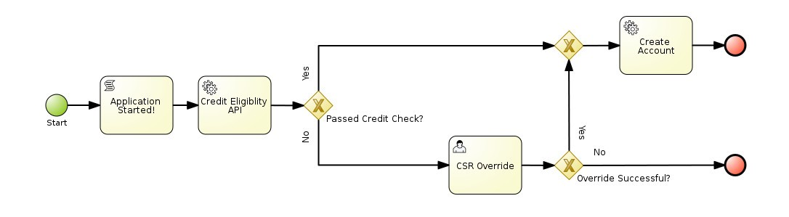

Lab 0 - Create Logging Service
==============================

In Eclipse, create a new maven project. Give it appropriate GAV coordinates.
Modify the pom.xml to include the JAX-RS dependencies

```
<project xmlns="http://maven.apache.org/POM/4.0.0" xmlns:xsi="http://www.w3.org/2001/XMLSchema-instance"
xsi:schemaLocation="http://maven.apache.org/POM/4.0.0 http://maven.apache.org/xsd/maven-4.0.0.xsd">
    <modelVersion>4.0.0</modelVersion>
    <groupId>com.capitalone.example</groupId>
    <artifactId>logging-service</artifactId>
    <version>1.0.0</version>
    <packaging>war</packaging>

    <dependencyManagement>
        <dependencies>
            <dependency>
                <groupId>org.jboss.bom</groupId>
                <artifactId>jboss-javaee-6.0-with-resteasy</artifactId>
                <version>1.0.4.Final-redhat-1</version>
                <type>pom</type>
                <scope>import</scope>
            </dependency>
        </dependencies>
    </dependencyManagement>

    <dependencies>
        <dependency>
            <groupId>org.jboss.spec.javax.ws.rs</groupId>
            <artifactId>jboss-jaxrs-api_1.1_spec</artifactId>
        </dependency>
        <dependency>
            <groupId>org.slf4j</groupId>
            <artifactId>slf4j-api</artifactId>
        </dependency>
    </dependencies>
</project>
```

Add two classes, the JAX-RS Application 
```
@ApplicationPath("services")
public class LoggingApplication extends Application{

}
```

And the JAX-RS resource
```
@Path("log")
public class LoggingService {
        
    private static final Logger LOG = LoggerFactory.getLogger("example.logging-service");

    @POST
    public void logMessage(final String message){
        LOG.info(message);
    }
}
```


Deploy the service to the BPMS server and test with your favorite REST client.


Lab 1 - Create Sample Project
=============================

In Eclipse, create a new jbpm (maven) project.
Adjust the pom.xml to take advantage of the BPMS BOM.
```
<dependencyManagement>
    <dependencies>
        <dependency>
            <groupId>org.jbpm</groupId>
            <artifactId>jbpm-bom</artifactId>
            <version>6.0.3-redhat-6</version>
            <scope>import</scope>
            <type>pom</type>
        </dependency>
    </dependencies>
</dependencyManagement>
```

Add the kie-maven-plugin configuration, and change the packaging to kjar
```
<build>
    <plugins>
        <plugin>
            <groupId>org.kie</groupId>
            <artifactId>kie-maven-plugin</artifactId>
            <version>6.0.3-redhat-6</version>
            <extensions>true</extensions>
        </plugin>
    </plugins>
</build>
```

If you like, before we move on, test the sample process with the ProcessMain class.
You can also create a JUnit test to perform the same logic as the ProcessMain class.

Clean up the sample process and ProcessMain class.
Edit the kmodule to point to an appropriate package.


Lab 2 - Create the Process Diagram
==================================
Draw the process diagram to match below



Lab 3 - Create Custom Work Item Handler
=======================================
Extend AbstractLogOrThrowWorkItemHandler

Lab 4 - Deploy the Process to the Execution Server
==================================================
See [Exec Server Example](https://github.com/djeremiah/bpms-exec-server-example)

Lab 5 - Invoke the Process and Task Items Remotely
==================================================
See [Exec Server Example](https://github.com/djeremiah/bpms-exec-server-example)


